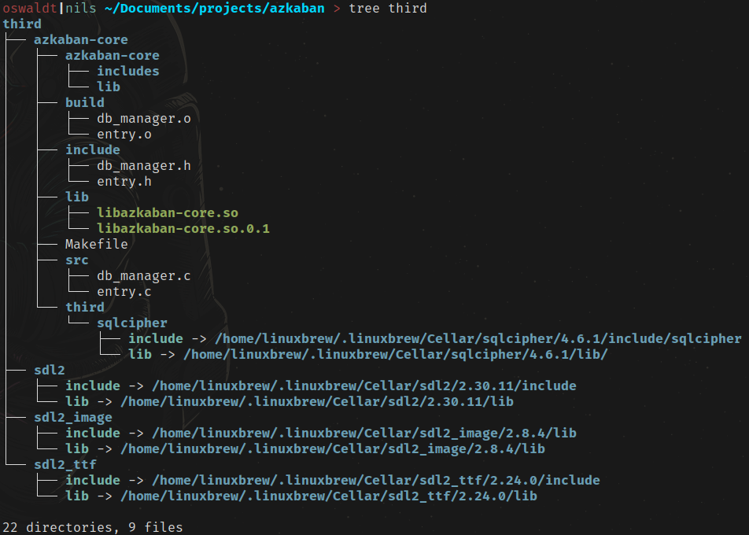

This is my attempt on a password manager.

I plan on writing it in c (to learn c) and maby later use some FFI (to learn FFI)

Planed features:

- Password generation
- Log in with YubiKey
- multiple YubiKey support
- save passwords, notes, images, documents
- be in one file so you can back it up easily
- probably no backup login method because screw you.
  You should have registered multiple YubiKeys and backed up one of them!

# How to clone this repo (with submodules)

`git clone --recurse-submodules https://github.com/N1lsE/azkaban`\
or
```bash
git clone https://github.com/N1lsE/azkaban
cd azkaban
git submodule update --init --recursive
```

# How to build

## Link third party librarys

## 1. Install them
I use `brew` to install them, because i mainly use a mac and on linux i can simply install brew too.

example - `brew install sdl2 sdl2_ttf sdl2_image`

list of all dependencies:
- `sdl2` - simple graphics library
- `sdl2_ttf` - fonts for sdl
- `sdl2_image` - images for sdl

## 2. link them
I create symlinks to a directory in my project. use the following structure: \
`azkaban/third/<library name>/include` \
`azkaban/third/<library name>/lib`

You can create one with:

sdl2\_ttf lib example: \
`ln -s /home/linuxbrew/.linuxbrew/Cellar/sdl2_ttf/2.24.0/lib /home/nils/Documents/projects/azkaban/third/sdl2_ttf/lib`

make sure to change the version to your installed one.

It should look something like this:


## Build submodule azkaban-core

Build the submodule so the library can be linked.
```bash
cd third/azkaban-core
make
cd ../..
```

## Building

`cd` into the root `azkaban` directory.\
Execute `make` and pray.

when errors appear fix them and repeat.

Make sure to pray every reqursion.

## nvim LSP support.

I had to search so i tell you how.

0. have clangd installed
0. install *bear*
0. run `bear -- make`

Bear - a tool to generate compilation database for Clang tooling.\
check `man bear` to see more

# How to handle submodules?

init - `git submodule update --init --recursive`\
update - `git submodule update --remote --merge`


